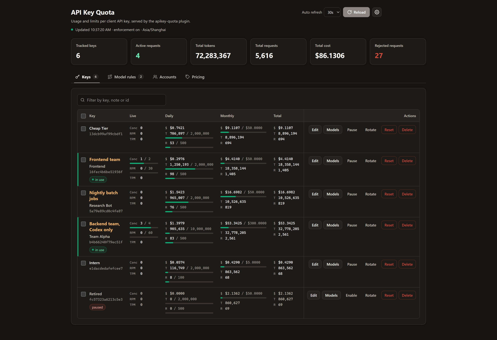

# API Key Quota for CLIProxyAPI

[中文](README_CN.md)

**Share one CLIProxyAPI instance with a team without one key draining everyone's accounts.**

Give each person or service its own API key, then cap it by tokens, requests, or US dollars per day, month, or in total. Every key gets rate limits, model rules, and fallback models, and a dashboard inside the CPA management center shows who is spending what.



## Why

When several people share one [CLIProxyAPI](https://github.com/router-for-me/CLIProxyAPI) instance, a single script in a loop can use up the Codex or Claude account for everyone, and you cannot tell who spent the money. This plugin enforces limits per key, inside CPA, before any request reaches the upstream.

- **Budgets per key.** Daily, monthly, and total ceilings on tokens, requests, or `cost_usd`. A built-in price table for Anthropic, OpenAI, and Google models makes dollar budgets work with no setup.
- **Rate limits.** RPM, TPM, and concurrency per key, and requests over the concurrency limit can queue for a free slot instead of failing at once.
- **Model control.** Deny `claude-*-opus*` for the cheap tier, silently map `sonnet` to `haiku`, and retry on fallback models when the upstream fails.
- **Account binding.** Keep a team on its own Codex or Claude accounts and cap each account's concurrency.
- **Schedules.** Open a key only during working hours, or give nights a quota of their own.
- **Dashboard.** Live usage, one-click pause, key rotation, batch actions, and per-model cost charts, in English and Chinese.
- **Safe by design.** Raw keys are never stored, only a truncated SHA-256 digest. State is written atomically.

## Quick start

1. Add this repository as a plugin store source and install `apikey-quota`, see [Install](#install).
2. Give every key a default budget:

   ```yaml
   plugins:
     enabled: true
     configs:
       apikey-quota:
         enabled: true
         time_zone: "Asia/Shanghai"
         default_limits:
           daily:
             requests: 500
           monthly:
             cost_usd: 50
   ```

3. Open the dashboard at `http://localhost:8080/v0/resource/plugins/apikey-quota/dashboard` (use your CPA host and port) and enter your management key.

A key that hits its ceiling gets `429` with an `insufficient_quota` error and code `quota_exceeded`, and daily or monthly rejections carry a `Retry-After` header. See [Configuration](#configuration) for everything else.

> Requires a CPA build with plugin RPC schema version 2 or newer. The plugin acts as CPA's request scheduler, and CPA uses only one scheduler plugin, so it cannot run together with another scheduler plugin.

## Install

Once the registry entry is merged into the official store, install it from the management API:

```text
POST /v0/management/plugin-store/apikey-quota/install
```

Before that, or to stay on your own channel, point CPA at this repository's registry:

```yaml
plugins:
  enabled: true
  store-sources:
    - "https://raw.githubusercontent.com/minifun1218/cliproxy-apikey-quota/main/registry.json"
```

The store resolves the latest GitHub release of this repository and installs the library to
`plugins/<goos>/<goarch>/apikey-quota-v<version>.<ext>`. To build it yourself instead, see [Build](#build).

## Behavior

- Accounts each API key under three periods at once: `daily`, `monthly`, and `total`. Daily and monthly buckets roll over according to `time_zone`.
- Tracks three dimensions per period: `tokens`, `requests`, and `cost_usd`. Cost is derived from the price table, not reported by the upstream, so a `cost_usd` limit is a spending budget.
- Ships a built-in price table covering current Anthropic, OpenAI, and Google models, so cost budgets work without configuring any prices.
- Rejects a request with `reject_status` (default `429`) and an `insufficient_quota` JSON body once any configured ceiling is reached. Daily and monthly rejections carry a `Retry-After` header pointing at the next period boundary.
- Rejects a disabled key with `403` and code `api_key_disabled`.
- Caps each key's requests per minute, tokens per minute, and concurrent requests, see [Rate limits](#rate-limits). A request over a rate limit gets `429` and code `rate_limit_exceeded`. With `queue_seconds`, a request over the concurrency limit waits for a free slot first.
- Binds keys to host accounts and caps each account's concurrent requests, see [Accounts](#accounts). A request no account can take gets `429` and code `account_busy`, or `503` and code `account_unavailable`.
- Restricts keys to time windows, each with its own quota and rate limits, see [Schedules](#schedules). A request outside the schedule gets `403` and code `outside_schedule`.
- Retries a request on a key's fallback models, in order, when the upstream fails with a timeout, rate limit, overload, or server error. The response carries `X-Apikey-Quota-Fallback` naming the model that answered.
- Refuses a model that matches a deny rule with `403` and code `model_blocked`, naming the rule that matched. Rules are glob patterns matched case-insensitively against the client-requested model, before any credential is selected.
- Never stores the raw API key. Keys are identified by a truncated SHA-256 digest (`id`) and displayed as a masked hint such as `sk-a...f9c1`.
- Reads the API key from the `Authorization`, `X-Goog-Api-Key`, and `X-Api-Key` headers. Query-string credentials are not visible to request interceptors, so those requests are still metered by `usage.handle` but are never blocked.
- Persists counters to `state_file` with an atomic temp-file rename, throttled by `persist_interval_seconds`, and forces a final write on `plugin.shutdown` and `plugin.quiesce`.

## Configuration

```yaml
plugins:
  enabled: true
  dir: "plugins"
  configs:
    apikey-quota:
      enabled: true
      priority: 10
      enforce: true
      state_file: "apikey-quota-state.json"
      persist_interval_seconds: 5
      reject_status: 429
      time_zone: "Asia/Shanghai"
      count_failed_requests: false
      track_unknown_keys: true
      blocked_models:
        - "gpt-4*"
      model_mappings:
        - from: "gpt-4o*"
          to: "gpt-5-mini"
        - from: "fast"
          to: "claude-haiku-4-5"
          provider: "claude"
      fallback_models:
        - "gpt-5-mini"
        - "gemini-2.5-flash"
      accounts:
        - match: "codex-team-alpha-*.json"
          concurrency: 2
          exclusive: true
        - match: "*"
          concurrency: 4
      default_limits:
        daily:
          tokens: 2000000
          requests: 500
        monthly:
          cost_usd: 50
      keys:
        - key: "sk-team-alpha"
          label: "Team Alpha"
          accounts:
            - "codex-team-alpha-*.json"
          strict_accounts: true
          limits:
            daily:
              tokens: 10000000
            total:
              cost_usd: 500
        - key: "sk-retired"
          label: "Retired Key"
          disabled: true
        - key: "sk-cheap-only"
          label: "Cheap Tier"
          blocked_models:
            - "claude-*-opus*"
            - "gpt-5-pro*"
          model_mappings:
            - from: "claude-*-sonnet*"
              to: "claude-haiku-4-5"
          fallback_models:
            - "claude-haiku-4-5"
      pricing:
        default:
          input: 1.25
          output: 10
        models:
          - match: "gpt-5*"
            input: 1.25
            output: 10
            cache_read: 0.125
          - match: "claude-*-haiku*"
            input: 0.8
            output: 4
```

### Fields

- `enforce`: when `false`, usage is still recorded but no request is ever blocked.
- `state_file`: JSON file holding accumulated counters. Relative paths resolve against the host working directory.
- `persist_interval_seconds`: minimum delay between state writes. `0` writes on every update.
- `reject_status`: HTTP status returned when a quota is exceeded. Must be 4xx or 5xx.
- `time_zone`: IANA name, `UTC`, or `Local`. Decides when the daily and monthly buckets roll over.
- `count_failed_requests`: charges failed upstream requests against the quota.
- `track_unknown_keys`: accounts for API keys that have no entry under `keys`. When `false`, unlisted keys are ignored entirely.
- `blocked_models`: glob patterns every API key is forbidden to call.
- `default_limits`: ceilings applied to keys without their own overrides.
- `default_rate_limits`: requests per minute, tokens per minute, and concurrency applied to every key, see [Rate limits](#rate-limits).
- `default_schedule`: time windows applied to keys without a schedule of their own, see [Schedules](#schedules).
- `model_mappings`: rules applied to every API key, see [Model mapping](#model-mapping).
- `fallback_models`: models tried in order when the requested model fails, for keys without a list of their own, see [Fallback models](#fallback-models).
- `fallback_status_codes`: upstream statuses that move a request on to the next fallback model. Defaults to `408`, `429`, `500`, `502`, `503`, `504`, and `529`.
- `accounts`: rules for host accounts, matched by ID, capping their concurrency and reserving them for their keys, see [Accounts](#accounts).
- `keys[]`: `key`, `label`, `disabled`, `blocked_models`, `model_mappings`, `fallback_models`, `accounts` and `strict_accounts` (see [Accounts](#accounts)), a `limits` block that overlays `default_limits`, `rate_limits` that overlay `default_rate_limits`, and a `schedule` that replaces `default_schedule`. A key's deny list is added to the global one rather than replacing it, a key's own mapping rules are checked before the global ones, and a key's own fallback list replaces the global one.
- `pricing`: USD prices per one million tokens, with `default` plus `models[]` entries matched by glob (`path.Match`). The most specific pattern wins. Leaving it out uses the built-in table.

### Price table

The price in force is resolved in this order:

1. A runtime override set through `POST /pricing` or the dashboard.
2. The `pricing` block in the configuration, when it sets any rate.
3. The built-in table in `go/pricing_defaults.go`.

The built-in table carries published rates as of September 2026 for the current Anthropic (`claude-opus-5`, `claude-sonnet-5`, `claude-haiku-4-5`, the Fable and Mythos tiers, `claude-sonnet-4-6`), OpenAI (`gpt-5.6-*`, `gpt-5.5`, `gpt-5.4*`, `gpt-5.2`, `gpt-5.1`, `gpt-5`, `gpt-5-mini`, `gpt-5-nano`), and Google (`gemini-3.8/3.7/3.6-flash`, `gemini-3.5/3.1-flash-lite`, `gemini-2.5-pro`, `gemini-2.5-flash`, `gemini-2.5-flash-lite`) models. Published prices change and some Google rates are promotional through 2026-12-31, so confirm them before billing anyone against the result.

A model that matches no rule falls back to `default`, which is zero in the built-in table. Such a model is billed at zero and is flagged `unpriced` in the dashboard and in `GET /pricing`, so an unpriced model never silently consumes a cost budget.

### Cost budgets

A `cost_usd` limit is the recommended way to cap usage, because one limit covers every model at its own rate:

```yaml
      default_limits:
        daily:
          cost_usd: 5
        monthly:
          cost_usd: 100
```

The counter advances by the price of each completed request, and the rejection names the figure: `api key quota exceeded: daily cost 0.0008/0.0005 USD`. Token and request limits still work and are checked in that order: tokens, then requests, then cost.

### Model mapping

Each rule rewrites a requested model to another model:

- `from`: glob pattern (`path.Match`) matched case-insensitively against the model the client asked for. A thinking suffix such as `(high)` is ignored for matching and carried over to the target when the target has none.
- `to`: the concrete model the request runs as.
- `provider`: optional built-in provider key, for example `claude`, `codex`, `gemini-cli`, `vertex`, or an OpenAI-compatible provider name. When omitted, the plugin infers it from the target model name (`claude*`, `gpt*`/`o*`/`codex*`, `gemini*`, `grok*`, `kimi*`) among the providers that have credentials, or uses the only provider available. A rule whose provider cannot be resolved is skipped and logged.

A key's own rules are checked first, then the global rules; the first match wins. Mapping runs in `model.route`, before provider resolution, so the target may live on a different provider than the requested model. Deny rules still match the model the client wrote, the mapped model is what the upstream bills, and each key counts how many of its requests were mapped. Mapping is independent of `enforce` and also applies to requests without an API key.

### Fallback models

A fallback list names models to try, in order, when the requested model fails upstream:

```yaml
      fallback_models:
        - "gpt-5-mini"
        - "gemini-2.5-flash"
      fallback_status_codes: [408, 429, 500, 502, 503, 504, 529]
```

- The first attempt runs the requested model, or the target of a matching mapping rule on that rule's provider. When it fails with one of `fallback_status_codes`, or without reaching any upstream (for example because no credential serves the model), the request moves on to the next model in the list. Any other failure, such as a `400`, is returned at once.
- Each entry is a concrete model name; the host picks its provider as it would for a client request. An entry equal to the first attempt is skipped, and a thinking suffix such as `(high)` is carried over like it is for mappings.
- When every model fails, the last failure is returned to the client with its original status.
- A key's own `fallback_models` replaces the global list. In the dashboard or through `POST /limits`, an empty list turns fallback off for that key.
- A streaming request falls back only while nothing has been sent: the host hands a stream over once its first chunk arrived, so a stream that breaks midway is passed on as it is.
- Token counting (`/v1/messages/count_tokens`) is never routed through fallback, because the host offers no way to forward it. Gemini `countTokens` cannot be told apart from a generate request at routing time, so for a key with fallback models it answers `501`.
- The quota check, deny rules, rate limits, and concurrency still apply once per client request. Each attempt is reported to `usage.handle` for the model that ran, so a failed attempt is only charged with `count_failed_requests`, and each key counts how many of its requests a fallback model answered.

Fallback needs the host's plugin executor routing, which is unavailable while CPA Home is enabled.

### Limit semantics

Every limit is a `{tokens, requests, cost_usd}` triple under `daily`, `monthly`, or `total`:

- A positive value is the ceiling.
- `0` inherits the value from `default_limits`.
- A negative value means unlimited and suppresses an inherited ceiling.

The configuration can set several dimensions for one period. The dashboard editor sets one per period: a dropdown picks the dimension (budget, tokens, or requests) and a single field takes its value, and the other two are sent as `0` so they inherit.

### Rate limits

`rate_limits` caps how fast a key is used, measured over a sliding window of the last minute:

- `rpm`: requests admitted during the last minute.
- `tpm`: tokens reported during the last minute. Tokens are only known once a request completes, so this ceiling refuses the requests that follow a burst; the request that crosses it still finishes.
- `concurrency`: requests in flight at the same time.
- `queue_seconds`: how long a request waits for a free slot when the key is at its `concurrency` limit, or every account it may use is at its own, before it is refused. `0` inherits, and without a value anywhere the request is refused at once.

```yaml
      default_rate_limits:
        rpm: 60
        tpm: 200000
        concurrency: 4
        queue_seconds: 30
```

A key's own `rate_limits` overlay `default_rate_limits`, and a runtime override from the dashboard overlays both, with the same semantics as limits: `0` inherits and a negative value means unlimited. A request over a rate limit is refused with `429`, type `rate_limit_error`, and code `rate_limit_exceeded`, and `Retry-After` gives the seconds until the window frees. Rate limits are checked after quotas and deny rules, so only requests that would otherwise run are counted. The last minute of activity lives in memory only and starts empty after a restart.

### Schedules

A schedule decides when a key may be used and under which limits. It is a list of recurring `windows` plus what happens outside all of them:

```yaml
      default_schedule:
        outside: allow          # or block
        windows:
          - name: lunch
            days: [weekdays]
            start: "12:00"
            end: "13:00"
            block: true
          - name: office
            days: [mon-fri]
            start: "09:00"
            end: "18:00"
            limits:
              cost_usd: 3
            rate_limits:
              rpm: 30
          - name: night
            start: "22:00"
            end: "08:00"
            rate_limits:
              rpm: 120
```

- `days` takes `mon` ... `sun`, ranges such as `mon-fri`, and `weekdays`, `weekends`, or `all`. Empty means every day. A window belongs to the day it starts on.
- `start` and `end` are `HH:MM` in `time_zone`. An end at or before the start runs past midnight; equal times cover a whole day.
- `block: true` refuses the key while the window is active.
- `limits` is a quota for one occurrence of the window. It restarts each time the window begins and applies on top of the daily, monthly, and total limits.
- `rate_limits` replaces the key's rate limits while the window is active.
- The first window covering a moment wins, so list narrow windows before wide ones. `outside: block` refuses the key at any moment no window covers.

A key's own `schedule` replaces `default_schedule`, and a schedule set in the dashboard replaces both. A refused request gets `403` with code `outside_schedule`, and `Retry-After` points at the next moment the schedule admits the key. A spent window quota is refused with `reject_status` and code `quota_exceeded` until the window ends.

### Accounts

Accounts are the host's credentials, the auth files and API keys CPA schedules requests on. The plugin identifies them by their host ID, usually the auth file name. It can bind a client API key to accounts and cap how many requests an account serves at once.

```yaml
      accounts:
        - match: "codex-team-alpha-*.json"
          concurrency: 2
          exclusive: true
        - match: "*"
          concurrency: 4
      keys:
        - key: "sk-team-alpha"
          accounts: ["codex-team-alpha-*.json"]
          strict_accounts: true
```

- `accounts[]` rules are matched against the account ID by glob; the first matching rule wins. `concurrency` caps the requests the account serves at the same time, and `0` means unlimited. An `exclusive` account only serves the keys bound to it.
- `keys[].accounts` lists account IDs or glob patterns. The key's requests are scheduled on those accounts first: the highest priority account with a free slot, then the least busy one, rotating among ties.
- When none of the bound accounts can serve a request, because none offers the model, all are cooling down, or all are at their limit, a key with `strict_accounts: true` gets an error. Any other key falls back to the shared accounts, which exclude exclusive accounts.
- When every account a key may use is at its concurrency limit, the request waits up to the key's `queue_seconds` for one to free up, then gets `429` and code `account_busy`. When no account is left at all, it gets `503` and code `account_unavailable`.
- A request of a key without bindings, when no candidate account has a rule, is left to the host's own `round-robin` or `fill-first` routing.

Account load counts a request from the moment the plugin picks its account until the host reports it complete, and moves with the request when the host retries it on another account. It lives in memory only. Account rules set in the dashboard replace the configured ones, and a binding set there replaces the key's configured binding. Requests the plugin's fallback executor forwards through the host skip the plugin's interceptors, so the executor tags each one with an `X-Apikey-Quota-Attempt` header; the pick holds the account under that tag, and the executor releases it when the call returns or its stream ends.

## Plugin capabilities

It declares seven optional capabilities:

- `request_interceptor`: evaluates the quota of the calling API key in `request.intercept_before` and terminates the request before any upstream executor runs when a ceiling is reached. `request.intercept_after` records which account the host picked, so account concurrency can be counted.
- `scheduler`: answers `scheduler.pick` to keep a key on the accounts bound to it and to skip accounts at their concurrency limit, see [Accounts](#accounts). The host uses only the first plugin that declares a scheduler, so this plugin cannot be combined with another scheduler plugin.
- `request_lifecycle_plugin`: receives `request.complete` for every admitted request so the plugin can report how many requests each API key currently has in flight. This live concurrency figure is kept in memory only.
- `usage_plugin`: accumulates token, request, and cost counters from `usage.handle` after each completed request.
- `model_router`: answers `model.route` to rewrite a requested model to another model, optionally on a named provider, before the host resolves providers and credentials.
- `executor`: serves the requests of keys that have fallback models. It runs the request through the host and, when the upstream fails, retries it on the next fallback model, see [Fallback models](#fallback-models).
- `management_api`: exposes JSON routes for usage, configuration, runtime limit overrides, and counter resets, plus a browser dashboard resource.

## Build

For the full release procedure (commit, tag, package, and publish a GitHub Release), see [docs/RELEASE.md](docs/RELEASE.md) (in Chinese).

From this directory:

```bash
cd go
go build -buildmode=c-shared -o apikey-quota.dylib .
rm -f apikey-quota.h
```

Use the platform extension expected by your target system:

- `.dylib` on macOS
- `.so` on Linux or FreeBSD
- `.dll` on Windows

The output filename is the plugin ID, so the artifact must be named `apikey-quota` for the configuration above.

The artifact must be a native library for the machine that runs CPA, not just a file with the right extension. A Linux `.so` copied to `plugins/apikey-quota.dll` loads on Windows with `%1 is not a valid Win32 application`, and the plugin then never registers. Cross-compiling needs a C toolchain for the target, so build on the target platform, or in a container that matches it.

## Troubleshooting

`GET /v0/management/plugins` reports `"registered": false`, and `/v0/resource/plugins/apikey-quota/dashboard` returns `404`: the host could not load the library. The startup log names the reason under `pluginhost: failed to load plugin apikey-quota`. A successful load logs `pluginhost: plugin registered`.

The dashboard reports `401`: the management key is wrong or missing. Every management request needs it, including from localhost, and `remote-management.secret-key` must be set in the host configuration.

The failure line reports how many characters were sent. When that count does not match the key being typed, the field holds something else, usually the credential a password manager saved for the control panel login on this same origin. Press `Show` to see the value the field really holds. `remote-management.secret-key` is stored as a bcrypt hash, so the plaintext cannot be read back out of the configuration file.

## Management API

Plugin routes are served under the management prefix and require the management key.

```text
GET  /v0/management/apikey-quota/usage
GET  /v0/management/apikey-quota/config
POST /v0/management/apikey-quota/limits
POST /v0/management/apikey-quota/reset
GET  /v0/management/apikey-quota/pricing
POST /v0/management/apikey-quota/pricing
POST /v0/management/apikey-quota/models
POST /v0/management/apikey-quota/mappings
POST /v0/management/apikey-quota/rotate
POST /v0/management/apikey-quota/delete
GET  /v0/management/apikey-quota/accounts
POST /v0/management/apikey-quota/accounts
```

`GET /usage` returns per-key used, limit, and remaining values for all three periods, plus a per-model breakdown, the number of blocked requests, and `concurrent`, the number of requests the key currently has in flight (the top-level `concurrent` is the sum over all keys).

`POST /limits` sets runtime overrides for one key identifier. These overlay the YAML configuration and survive restarts through the state file.

```json
{"id": "9f2c1ab34de5678f", "limits": {"daily": {"tokens": 5000000}}, "disabled": false,
 "blocked_models": ["claude-*-opus*"]}
```

`blocked_models` replaces that key's own deny list; the global list still applies on top of it. `model_mappings`, a list of `{"from", "to", "provider"}` rules, likewise replaces that key's own mapping rules. `fallback_models` replaces the key's fallback list, where `[]` turns fallback off for it, and `"clear_fallback_models": true` makes it follow the global list again. Sending only `{"id": "...", "disabled": true}` pauses a key without touching its limits or deny list, and `"disabled": false` resumes it with both intact. `rate_limits` (`{"rpm", "tpm", "concurrency"}`) overlays the key's configured rate limits, `schedule` replaces its schedule, and `"clear_schedule": true` drops that replacement. `accounts` replaces the key's account binding, where `[]` unbinds it, `strict_accounts` sets its strict flag, and `"clear_accounts": true` restores the configured binding. `GET /usage` reports both per key.

Send `{"id": "...", "clear": true}` to drop the overrides and fall back to the configured limits.

Both `POST /limits` and `POST /reset` also take `ids`, a list of key identifiers, and apply the same change to each of them in one call, for example `{"ids": ["9f2c1ab34de5678f", "3f2a9c0d1b7e4a55"], "disabled": true}`. `id` and `ids` may be combined.

`POST /reset` clears counters for one period, for one key or for every key in `ids`.

```json
{"id": "9f2c1ab34de5678f", "period": "daily"}
```

`period` accepts `daily`, `monthly`, `total`, or `all`. `all` also clears the per-model breakdown and the blocked counter.

`GET /pricing` returns the price table in force, its `source` (`runtime`, `config`, or `builtin`), and an `observed` list naming every model the plugin has billed together with the rule each one matched and the cost it produced. An empty `matched` means the default price applied, and `"priced": false` marks a model no rule covers.

`POST /pricing` replaces the price table at runtime.

```json
{"default": {"input": 1.25, "output": 10},
 "models": [{"match": "claude-*", "input": 3, "output": 15, "cache_read": 0.3}]}
```

`POST /models` replaces the global deny list.

```json
{"blocked_models": ["gpt-4*", "gemini-*"]}
```

`POST /mappings` replaces the global mapping rules.

```json
{"model_mappings": [{"from": "gpt-4o*", "to": "gpt-5-mini", "provider": "codex"}]}
```

`POST /fallbacks` replaces the global fallback models.

```json
{"fallback_models": ["gpt-5-mini", "gemini-2.5-flash"]}
```

`GET /usage` also reports the global `fallback_models` and whether they are overridden (`fallback_models_overridden`), and per key `fallback_models` (the list in force), `own_fallback_models` (`null` when the key follows the global list), and `fallbacks`, the number of requests a fallback model answered. It also reports the global `model_mappings`, whether they are overridden, `providers` (the built-in providers with credentials that the host last offered to `model.route`), and per key `model_mappings`, `own_model_mappings`, and `mapped`.

`GET /accounts` lists the host's accounts, fetched through `host.auth.list`, with `concurrent` (requests in flight), `limit`, `exclusive`, the matching `rule`, and `bound_keys`, plus the account `rules` in force. Accounts serving requests but missing from the host list are included too, and `listed: false` with `list_error` reports a failed host listing. `POST /accounts` replaces the account rules and answers with the same view.

```json
{"rules": [{"match": "codex-team-*.json", "concurrency": 2, "exclusive": true}]}
```

All five accept `{"clear": true}` to drop the override and fall back to the YAML configuration. Overrides are stored under `settings` in the state file, so they survive a restart.

`POST /rotate` moves one key's usage, limits, note, deny list, and mappings to its replacement key. It does not change the host's key list: the dashboard first replaces the key through the host's `PATCH /v0/management/api-keys`, then calls this route. `new_key` is only hashed and masked, never stored.

```json
{"id": "3f2a9c0d1b7e4a55", "new_key": "sk-..."}
```

`POST /delete` removes the usage records, limits, note, deny list, and mappings of one or more keys. Like `/rotate`, it does not change the host's key list: the dashboard first removes each key through the host's `DELETE /v0/management/api-keys?value=...`, then calls this route.

```json
{"ids": ["3f2a9c0d1b7e4a55", "9f2c1ab34de5678f"]}
```

The response lists `deleted`, `missing` (ids that were neither tracked nor configured), and `configured`: ids that also have an entry under `keys` in the plugin configuration. Those keys keep being listed, with zeroed usage, until the entry is removed from the configuration. A key that is still accepted by the host is tracked again on its next request.

The response carries the new `id` and `hint`. When the old key also had an entry under `keys` in the plugin configuration, `configured` is `true`: that entry's settings are copied onto the new key as runtime overrides, and the entry itself should be updated to the new key or removed.

## Dashboard

The plugin registers a browser resource named `API Key Quota`, served at:

```text
http://localhost:8080/v0/resource/plugins/apikey-quota/dashboard
```

The resource prefix is unauthenticated, so the page embeds no usage data. It asks for the management key, fetches every figure from the authenticated JSON routes above with an `X-Management-Key` header, and caches the key in `sessionStorage` only after a request succeeds. The table supports editing limits and resetting counters inline.

The key is required even on localhost. The page sends no request until one is entered, and it stops auto refresh after a `401` or `403` instead of retrying, because the host bans a client IP for 30 minutes once five management keys have been rejected.

The header holds the page-level controls: auto refresh, **Reload**, and a settings button that opens a dialog for the management key and the interface language. The dialog opens on its own when no key is stored yet.

The page has four tabs, each with a count badge. **Keys** lists per-key usage, limits, deny rules, and the reject counter, with a filter by key, note, or id. The note leads each key cell in a larger, colored font, followed by the masked key and its id. The **Live** column shows the concurrent requests, requests per minute, and tokens per minute against their ceilings, and the quota of an active schedule window; a key cell marks the window in force or that the key is outside its schedule. Each row offers **Edit**, **Models**, a one-click **Pause** / **Enable**, **Rotate**, **Reset**, and **Delete**; the actions column stays pinned when the table scrolls sideways. **Edit** opens an editor for the note, a pause switch, limits, rate limits, a schedule, and that key's own deny list and model mappings. The schedule section switches between the inherited schedule and one of the key's own, whose windows are edited as cards with day chips, start and end times, block or window quota and rates, and a button to move a window up. **Models** shows the key's per-model usage as a donut chart above the table, switchable between cost, tokens, and requests; the seven largest models get their own slice and the rest fold into "Other". Each period in the editor takes one ceiling, chosen from a dropdown, and the key's deny list is edited as a list of chips with an add field suggesting the models that key has actually called. The requested model of a per-key mapping is picked from a dropdown of known models, with a custom entry for glob patterns. **Rotate** replaces the key in the host with a newly generated random key and moves its usage and settings to it; the new key is shown once, with a copy button. The old key stops working immediately. Only keys in the host's `api-keys` list can be rotated. **Delete** lists the keys it will remove and, unless its switch is turned off, removes them from the host's `api-keys` list first, so they stop working immediately; a key the host fails to remove keeps its record. Keys that cannot be removed completely, such as keys missing from the host list or configured in the plugin, are reported in the dialog. A checkbox column selects keys for batch work, and the header checkbox selects every key the filter shows. While keys are selected, a bar above the table offers **Pause**, **Enable**, **Rotate**, **Reset**, and **Delete** for all of them at once. A batch rotation replaces the keys one after another and shows every new key as a `name: key` line, copied together with one click. Resetting a key opens its own dialog with a period dropdown, so every action is confirmed in the page rather than in a browser prompt. **Edit** also has a fallback section: a switch gives the key a list of its own, one model per line, and leaving that list empty turns fallback off for the key; a key served by a fallback model shows a `fallback` count badge. **Model rules** edits the global deny list, the global model mappings, and the global fallback models, and marks unsaved mapping edits with a dot on the tab. **Accounts** lists the host's accounts with their live concurrency against their limit, the rule that applies, and the keys bound to them, and edits the account rules. **Edit** has an accounts section too: bound accounts are chips, added from a field suggesting the host's account IDs, with a switch that keeps the key on them; a bound key shows an `accounts` badge. The rate limits section takes the queue wait. **Pricing** edits the price table, names where the current prices came from, and lists the recognized models with the price rule each one resolved to. A switch above that list shows the same donut chart for all recognized models; the choice is remembered in `localStorage`.

The language choice is remembered in `localStorage`; the initial language follows `navigator.language`. The styling matches the CLIProxyAPI management center. When the page is embedded there, it follows the host's light, white, or dark theme; opened on its own, it follows the browser's light or dark preference.

## Relevant RPC Methods

```text
plugin.register
plugin.reconfigure
plugin.shutdown
plugin.quiesce
model.route
executor.identifier
executor.execute
executor.execute_stream
executor.count_tokens
request.intercept_before
request.intercept_after
request.complete
scheduler.pick
usage.handle
management.register
management.handle
```
