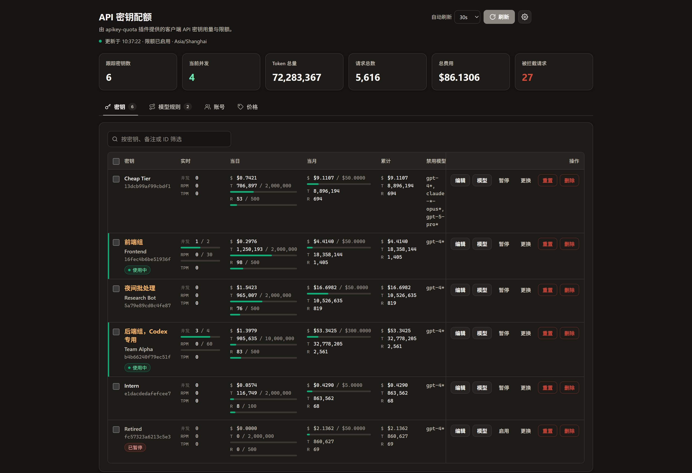

# CLIProxyAPI API Key 配额插件

[English](README.md)

**一台 CLIProxyAPI 多人共用，不再被某一把 key 把所有账号跑空。**

给每个人、每个服务单独发一把 API key，再按天、按月或累计限制它的 token、请求数或美元花费。每把 key 都能单独配置限速、模型规则和兜底模型，用量看板直接嵌在 CPA 管理中心里，谁花了多少一目了然。



## 为什么需要它

几个人共用一台 [CLIProxyAPI](https://github.com/router-for-me/CLIProxyAPI) 时，只要有一个脚本在死循环，就能把大家的 Codex 或 Claude 账号额度用完，而且事后查不出是谁花的。这个插件在 CPA 内部按 key 做限制，请求到达上游之前就拦下来。

- **按 key 设预算。** 当日、当月、累计三个周期，可以限 token、请求数或 `cost_usd`。内置 Anthropic、OpenAI、Google 模型价格表，美元预算开箱即用。
- **限速。** 每把 key 单独设置 RPM、TPM 和并发，超出并发的请求可以排队等空位，不必直接失败。
- **模型管控。** 给低档 key 禁掉 `claude-*-opus*`，把 `sonnet` 悄悄映射成 `haiku`，上游出错时自动改用兜底模型重试。
- **账号绑定。** 让某个团队只用自己的 Codex 或 Claude 账号，并限制每个账号的并发。
- **时间窗。** key 只在工作时间可用，或者给夜间单独一份配额。
- **看板。** 实时用量、一键暂停、更换 key、批量操作、按模型的费用图表，支持中英文。
- **安全。** 从不保存原始 key，只存截断的 SHA-256 摘要，状态文件原子写入。

## 快速开始

1. 把本仓库加为插件商店源并安装 `apikey-quota`，见[安装](#安装)。
2. 给所有 key 设一个默认预算：

   ```yaml
   plugins:
     enabled: true
     configs:
       apikey-quota:
         enabled: true
         time_zone: "Asia/Shanghai"
         default_limits:
           daily:
             requests: 500
           monthly:
             cost_usd: 50
   ```

3. 打开看板 `http://localhost:8080/v0/resource/plugins/apikey-quota/dashboard`（换成你的 CPA 地址和端口），输入管理密钥。

key 超额后会收到 `429`，错误类型为 `insufficient_quota`、错误码为 `quota_exceeded`；日、月周期的拒绝还会带上 `Retry-After` 头。其余配置见[配置](#配置)。

> 需要支持插件 RPC schema 版本 2 或更高的 CPA。本插件会充当 CPA 的请求调度器，而 CPA 只采用一个调度插件，因此它不能与其他调度插件同时使用。

## 安装

注册条目合并进官方商店后，通过 Management API 安装：

```text
POST /v0/management/plugin-store/apikey-quota/install
```

在此之前，或者你想走自己的分发渠道，把 CPA 指向本仓库的 registry：

```yaml
plugins:
  enabled: true
  store-sources:
    - "https://raw.githubusercontent.com/minifun1218/cliproxy-apikey-quota/main/registry.json"
```

商店会解析本仓库的最新 GitHub release，并把动态库安装到
`plugins/<goos>/<goarch>/apikey-quota-v<version>.<ext>`。若想自行编译，见下文[构建](#构建)。

## 行为

- 每个 API 密钥同时按三个周期记账：`daily`（当日）、`monthly`（当月）和 `total`（累计）。日、月周期按 `time_zone` 翻篇。
- 每个周期跟踪三个维度：`tokens`、`requests` 和 `cost_usd`。费用由价格表推算得出，并非上游上报，因此 `cost_usd` 限额本质上是一份消费预算。
- 内置一份覆盖 Anthropic、OpenAI 和 Google 当前模型的价格表，因此不配置任何价格也能使用费用预算。
- 一旦触及任一配置的上限，请求会以 `reject_status`（默认 `429`）和 `insufficient_quota` JSON 响应体被拒绝。日、月周期的拒绝还会带上指向下一个周期边界的 `Retry-After` 响应头。
- 被禁用的密钥返回 `403`，错误码为 `api_key_disabled`。
- 限制每个密钥的每分钟请求数、每分钟 token 数和并发数，见[速度限制](#速度限制)。超出速度限制的请求返回 `429`，错误码为 `rate_limit_exceeded`。设置 `queue_seconds` 后，超出并发上限的请求会先排队等待空位。
- 可以把密钥绑定到宿主账号，并限制每个账号的并发数，见[账号](#账号)。没有账号能接的请求返回 `429`（错误码 `account_busy`）或 `503`（错误码 `account_unavailable`）。
- 按时段限制密钥的使用，每个时段可以有自己的限额和速度限制，见[时段规则](#时段规则)。不在允许时段内的请求返回 `403`，错误码为 `outside_schedule`。
- 上游超时、限流、过载或服务端出错时，按顺序改用密钥的兜底模型重试。响应头 `X-Apikey-Quota-Fallback` 会给出最终应答的模型。
- 命中禁用规则的模型返回 `403`，错误码为 `model_blocked`，并指出命中的是哪条规则。规则是通配（glob）模式，对客户端请求的模型名做大小写不敏感匹配，且发生在选择凭证之前。
- 从不存储原始 API 密钥。密钥以截断后的 SHA-256 摘要（`id`）标识，展示时使用 `sk-a...f9c1` 这样的掩码提示。
- 从 `Authorization`、`X-Goog-Api-Key` 和 `X-Api-Key` 请求头读取 API 密钥。查询字符串中的凭证对请求拦截器不可见，因此那类请求仍会被 `usage.handle` 计量，但永远不会被拦截。
- 计数通过临时文件原子重命名的方式写入 `state_file`，写入频率受 `persist_interval_seconds` 节流，并在 `plugin.shutdown` 和 `plugin.quiesce` 时强制落盘一次。

## 配置

```yaml
plugins:
  enabled: true
  dir: "plugins"
  configs:
    apikey-quota:
      enabled: true
      priority: 10
      enforce: true
      state_file: "apikey-quota-state.json"
      persist_interval_seconds: 5
      reject_status: 429
      time_zone: "Asia/Shanghai"
      count_failed_requests: false
      track_unknown_keys: true
      blocked_models:
        - "gpt-4*"
      model_mappings:
        - from: "gpt-4o*"
          to: "gpt-5-mini"
        - from: "fast"
          to: "claude-haiku-4-5"
          provider: "claude"
      fallback_models:
        - "gpt-5-mini"
        - "gemini-2.5-flash"
      accounts:
        - match: "codex-team-alpha-*.json"
          concurrency: 2
          exclusive: true
        - match: "*"
          concurrency: 4
      default_limits:
        daily:
          tokens: 2000000
          requests: 500
        monthly:
          cost_usd: 50
      keys:
        - key: "sk-team-alpha"
          label: "Team Alpha"
          accounts:
            - "codex-team-alpha-*.json"
          strict_accounts: true
          limits:
            daily:
              tokens: 10000000
            total:
              cost_usd: 500
        - key: "sk-retired"
          label: "Retired Key"
          disabled: true
        - key: "sk-cheap-only"
          label: "Cheap Tier"
          blocked_models:
            - "claude-*-opus*"
            - "gpt-5-pro*"
          model_mappings:
            - from: "claude-*-sonnet*"
              to: "claude-haiku-4-5"
          fallback_models:
            - "claude-haiku-4-5"
      pricing:
        default:
          input: 1.25
          output: 10
        models:
          - match: "gpt-5*"
            input: 1.25
            output: 10
            cache_read: 0.125
          - match: "claude-*-haiku*"
            input: 0.8
            output: 4
```

### 字段说明

- `enforce`：为 `false` 时仍然记录用量，但不会拦截任何请求。
- `state_file`：保存累计计数的 JSON 文件。相对路径基于宿主进程的工作目录解析。
- `persist_interval_seconds`：两次状态写盘之间的最小间隔。`0` 表示每次更新都写盘。
- `reject_status`：超出配额时返回的 HTTP 状态码，必须是 4xx 或 5xx。
- `time_zone`：IANA 时区名、`UTC` 或 `Local`，决定日、月周期何时翻篇。
- `count_failed_requests`：是否把上游失败的请求也计入配额。
- `track_unknown_keys`：是否为 `keys` 中没有条目的 API 密钥记账。为 `false` 时，未列出的密钥会被完全忽略。
- `blocked_models`：所有 API 密钥都禁止调用的通配规则。
- `default_limits`：应用于没有自身覆盖值的密钥的上限。
- `default_rate_limits`：应用于所有密钥的每分钟请求数、每分钟 token 数和并发数，见[速度限制](#速度限制)。
- `default_schedule`：应用于没有自身时段规则的密钥，见[时段规则](#时段规则)。
- `model_mappings`：对所有 API 密钥生效的映射规则，见[模型映射](#模型映射)。
- `fallback_models`：请求的模型失败时按顺序尝试的模型，作用于没有单独设置兜底列表的密钥，见[兜底模型](#兜底模型)。
- `fallback_status_codes`：触发改用下一个兜底模型的上游状态码，默认为 `408`、`429`、`500`、`502`、`503`、`504` 和 `529`。
- `accounts`：宿主账号规则，按账号 ID 匹配，用于限制账号并发并把账号保留给绑定它的密钥，见[账号](#账号)。
- `keys[]`：包含 `key`、`label`、`disabled`、`blocked_models`、`model_mappings`、`fallback_models`、`accounts` 和 `strict_accounts`（见[账号](#账号)），以及叠加在 `default_limits` 之上的 `limits` 块、叠加在 `default_rate_limits` 之上的 `rate_limits`，和替换 `default_schedule` 的 `schedule`。某个密钥的禁用列表是**追加**在全局列表之上，而不是替换它；该密钥自己的映射规则优先于全局规则检查；该密钥自己的兜底列表会替换全局列表。
- `pricing`：每百万 token 的美元价格，包含 `default` 以及按通配规则（`path.Match`）匹配的 `models[]` 条目。最具体的规则优先。不填则使用内置价格表。

### 价格表

生效的价格按以下顺序解析：

1. 通过 `POST /pricing` 或面板设置的运行时覆盖。
2. 配置文件中的 `pricing` 块（只要它设置了任意一项费率）。
3. `go/pricing_defaults.go` 中的内置价格表。

内置表收录的是 2026 年 9 月各家公布的费率，覆盖当前的 Anthropic（`claude-opus-5`、`claude-sonnet-5`、`claude-haiku-4-5`、Fable 与 Mythos 档位、`claude-sonnet-4-6`）、OpenAI（`gpt-5.6-*`、`gpt-5.5`、`gpt-5.4*`、`gpt-5.2`、`gpt-5.1`、`gpt-5`、`gpt-5-mini`、`gpt-5-nano`）和 Google（`gemini-3.8/3.7/3.6-flash`、`gemini-3.5/3.1-flash-lite`、`gemini-2.5-pro`、`gemini-2.5-flash`、`gemini-2.5-flash-lite`）模型。公布价格会变动，部分 Google 费率是截至 2026-12-31 的促销价，因此在据此向任何人计费之前请自行核对。

匹配不到任何规则的模型会回落到 `default`，而内置表中的 `default` 为零。这类模型按零计费，并在面板和 `GET /pricing` 中标记为 `unpriced`（无价格），因此未定价的模型不会悄无声息地消耗费用预算。

### 费用预算

`cost_usd` 限额是推荐的用量封顶方式，因为一条限制就能覆盖所有模型（各按各自费率计算）：

```yaml
      default_limits:
        daily:
          cost_usd: 5
        monthly:
          cost_usd: 100
```

计数按每次完成请求的价格推进，拒绝信息会给出具体数字：`api key quota exceeded: daily cost 0.0008/0.0005 USD`。token 和请求数限额依然有效，检查顺序为：先 token，再请求数，最后费用。

### 模型映射

每条规则把请求的模型改写为另一个模型：

- `from`：通配规则（`path.Match`），不区分大小写地匹配客户端请求的模型。匹配时忽略 `(high)` 这类思考后缀；若目标模型没有后缀，则把原后缀带到目标模型上。
- `to`：请求实际使用的具体模型名。
- `provider`：可选的内置提供商标识，例如 `claude`、`codex`、`gemini-cli`、`vertex`，或 OpenAI 兼容提供商的名称。留空时，插件会在已配置凭证的提供商中按目标模型名推断（`claude*`、`gpt*`/`o*`/`codex*`、`gemini*`、`grok*`、`kimi*`），若只有一个可用提供商则直接使用它。无法确定提供商的规则会被跳过并记录日志。

先检查密钥自己的规则，再检查全局规则，命中第一条即生效。映射发生在 `model.route` 阶段、早于提供商解析，因此目标模型可以位于与原模型不同的提供商上。禁用规则仍然匹配客户端所写的模型，计费按映射后的模型计算，并且每个密钥都会统计被映射的请求数。映射不受 `enforce` 影响，对未携带 API 密钥的请求同样生效。

### 兜底模型

兜底列表给出请求的模型在上游失败时，按顺序改用的模型：

```yaml
      fallback_models:
        - "gpt-5-mini"
        - "gemini-2.5-flash"
      fallback_status_codes: [408, 429, 500, 502, 503, 504, 529]
```

- 第一次尝试使用请求的模型；若命中映射规则，则使用映射目标及该规则的提供商。失败状态码属于 `fallback_status_codes`，或者请求根本没有到达上游（例如没有凭证能服务该模型）时，改用列表中的下一个模型。其他失败（例如 `400`）会立即返回。
- 每一项都是具体的模型名，由宿主像处理普通客户端请求一样为它选择提供商。与第一次尝试相同的模型会被跳过；`(high)` 这类思考后缀会像映射一样带到兜底模型上。
- 所有模型都失败时，把最后一次失败按原状态码返回给客户端。
- 密钥自己的 `fallback_models` 会替换全局列表。在面板或 `POST /limits` 中把该密钥的列表设为空，即可为该密钥关闭兜底。
- 流式请求只在尚未输出任何内容时兜底：宿主在收到第一个数据块后才交出流，因此中途断开的流会原样传给客户端。
- 计数 token 的请求（`/v1/messages/count_tokens`）不会走兜底，因为宿主没有提供转发它的途径。Gemini 的 `countTokens` 在路由阶段无法与生成请求区分，因此对配置了兜底模型的密钥会返回 `501`。
- 配额检查、禁用规则、速度限制和并发限制仍按每个客户端请求执行一次。每次尝试都会以实际运行的模型上报给 `usage.handle`，因此失败的尝试只有在开启 `count_failed_requests` 时才计费；每个密钥还会统计由兜底模型应答的请求数。

兜底依赖宿主的插件执行器路由，CPA Home 开启时不可用。

### 限额语义

每条限额都是 `daily`、`monthly` 或 `total` 下的一个 `{tokens, requests, cost_usd}` 三元组：

- 正数表示上限。
- `0` 表示继承 `default_limits` 中的值。
- 负数表示不限，并抑制继承来的上限。

配置文件可以为同一周期设置多个维度。面板编辑器则每个周期只设一个：下拉框选择维度（预算、Token 数或请求数），单个输入框填值，另外两个维度会以 `0` 提交从而继承配置。

### 速度限制

`rate_limits` 限制密钥的使用速度，按最近一分钟的滑动窗口统计：

- `rpm`：最近一分钟内放行的请求数。
- `tpm`：最近一分钟内上报的 token 数。token 数要等请求完成后才知道，所以这个上限拦截的是突发用量之后的请求，越过上限的那个请求仍会正常完成。
- `concurrency`：同时进行中的请求数。
- `queue_seconds`：当密钥达到 `concurrency` 上限，或它可用的全部账号都达到各自的上限时，请求最多排队等待这么多秒，仍无空位才被拒绝。`0` 表示继承；各处都没有设置时请求会被立即拒绝。

```yaml
      default_rate_limits:
        rpm: 60
        tpm: 200000
        concurrency: 4
        queue_seconds: 30
```

密钥自身的 `rate_limits` 叠加在 `default_rate_limits` 之上，面板中设置的运行时覆盖再叠加在两者之上，语义与限额相同：`0` 表示继承，负数表示不限。超出速度限制的请求返回 `429`，类型为 `rate_limit_error`，错误码为 `rate_limit_exceeded`，`Retry-After` 给出窗口空出所需的秒数。速度限制在限额和禁用规则之后检查，因此只统计本来会被放行的请求。最近一分钟的数据只保存在内存中，重启后清零。

### 时段规则

时段规则决定密钥在什么时间可以使用、按什么限额使用。它由一组循环出现的 `windows`，加上所有时段之外的处理方式组成：

```yaml
      default_schedule:
        outside: allow          # 或 block
        windows:
          - name: 午休
            days: [weekdays]
            start: "12:00"
            end: "13:00"
            block: true
          - name: 工作时间
            days: [mon-fri]
            start: "09:00"
            end: "18:00"
            limits:
              cost_usd: 3
            rate_limits:
              rpm: 30
          - name: 夜间
            start: "22:00"
            end: "08:00"
            rate_limits:
              rpm: 120
```

- `days` 接受 `mon` ... `sun`、`mon-fri` 这样的范围，以及 `weekdays`、`weekends`、`all`。留空表示每天。时段归属于它开始的那一天。
- `start` 和 `end` 是 `time_zone` 时区下的 `HH:MM`。结束时间早于或等于开始时间表示跨过午夜；两者相同表示全天。
- `block: true` 表示该时段内禁止使用该密钥。
- `limits` 是该时段每次出现时的限额，每次时段开始时重新计算，并与日、月、累计限额同时生效。
- `rate_limits` 在该时段内替换密钥的速度限制。
- 某一时刻按第一个覆盖它的时段处理，因此较窄的时段应排在较宽的时段之前。`outside: block` 表示不在任何时段内时禁止使用。

密钥自身的 `schedule` 会替换 `default_schedule`，面板中设置的时段规则又会替换两者。被时段规则拒绝的请求返回 `403`，错误码为 `outside_schedule`，`Retry-After` 指向下一个允许使用的时刻。时段限额用完后，请求以 `reject_status` 和错误码 `quota_exceeded` 被拒绝，直到该时段结束。

### 账号

账号指宿主中的凭证，即 CPA 用来调度请求的认证文件和 API 密钥。插件以宿主中的账号 ID 识别它们，通常就是认证文件名。插件可以把客户端 API 密钥绑定到账号，并限制每个账号同时处理的请求数。

```yaml
      accounts:
        - match: "codex-team-alpha-*.json"
          concurrency: 2
          exclusive: true
        - match: "*"
          concurrency: 4
      keys:
        - key: "sk-team-alpha"
          accounts: ["codex-team-alpha-*.json"]
          strict_accounts: true
```

- `accounts[]` 规则按通配符匹配账号 ID，第一条匹配的规则生效。`concurrency` 限制该账号同时处理的请求数，`0` 表示不限。`exclusive` 账号只为绑定了它的密钥服务。
- `keys[].accounts` 列出账号 ID 或通配符。该密钥的请求优先调度到这些账号：先选优先级最高且有空位的账号，再选最空闲的，条件相同的账号之间轮换。
- 当绑定的账号都无法处理请求时（都不提供该模型、都在冷却，或都已达上限），`strict_accounts: true` 的密钥直接得到错误；其他密钥退回到共享账号，共享账号不包括独占账号。
- 当密钥可用的全部账号都达到并发上限时，请求最多等待该密钥的 `queue_seconds`，之后返回 `429`，错误码为 `account_busy`。完全没有可用账号时返回 `503`，错误码为 `account_unavailable`。
- 未绑定账号的密钥，在所有候选账号都没有匹配规则时，仍由宿主自己的 `round-robin` 或 `fill-first` 策略调度。

账号负载从插件选中账号时开始计数，直到宿主报告请求完成；宿主把请求重试到另一个账号时，计数随之转移。负载只保存在内存中。面板中设置的账号规则会替换配置中的规则，面板中设置的绑定会替换该密钥配置中的绑定。插件的兜底执行器经由宿主转发的请求不会经过插件的拦截器，因此执行器会给每次转发加上 `X-Apikey-Quota-Attempt` 请求头，选号时以这个标记占用账号，调用返回或流结束时由执行器释放。

## 插件能力

它声明了七项可选能力：

- `request_interceptor`：在 `request.intercept_before` 中评估调用方 API 密钥的配额，达到上限时在任何上游执行器运行之前终止请求。`request.intercept_after` 记录宿主选中的账号，用于统计账号并发。
- `scheduler`：响应 `scheduler.pick`，让密钥只在绑定给它的账号上调度，并跳过已达并发上限的账号，见[账号](#账号)。宿主只采用第一个声明了调度器的插件，因此本插件不能与其他调度插件同时使用。
- `request_lifecycle_plugin`：接收每个已放行请求的 `request.complete` 事件，用于统计每个 API 密钥当前正在进行中的请求数（并发数）。该实时并发数只保存在内存中。
- `usage_plugin`：每次请求完成后，从 `usage.handle` 累加 token、请求数和费用计数。
- `model_router`：响应 `model.route`，在宿主解析提供商和凭证之前，把请求的模型改写为另一个模型，并可指定目标提供商。
- `executor`：承接配置了兜底模型的密钥的请求。它经由宿主执行请求，上游失败时改用下一个兜底模型重试，见[兜底模型](#兜底模型)。
- `management_api`：暴露用量、配置、运行时限额覆盖和计数重置的 JSON 路由，以及一个浏览器面板资源。

## 构建

发布新版本（提交、打标签、打包、上传 Release）的完整步骤见 [docs/RELEASE.md](docs/RELEASE.md)。

在本目录下执行：

```bash
cd go
go build -buildmode=c-shared -o apikey-quota.dylib .
rm -f apikey-quota.h
```

请使用目标系统对应的平台扩展名：

- macOS 使用 `.dylib`
- Linux 或 FreeBSD 使用 `.so`
- Windows 使用 `.dll`

输出文件名即插件 ID，因此上面的配置要求产物必须命名为 `apikey-quota`。

产物必须是运行 CPA 的那台机器的**原生库**，而不仅仅是扩展名正确的文件。把 Linux 的 `.so` 复制成 `plugins/apikey-quota.dll`，在 Windows 上加载会报 `%1 is not a valid Win32 application`，插件随后不会注册。交叉编译需要目标平台的 C 工具链，因此请在目标平台上构建，或使用与之匹配的容器。

## 故障排查

**`GET /v0/management/plugins` 返回 `"registered": false`，且 `/v0/resource/plugins/apikey-quota/dashboard` 返回 `404`**：宿主没能加载这个动态库。启动日志中 `pluginhost: failed to load plugin apikey-quota` 一行会给出原因。加载成功则会记录 `pluginhost: plugin registered`。

**面板返回 `401`**：管理密钥错误或缺失。所有管理请求都需要它，本机访问也不例外，并且宿主配置中必须设置 `remote-management.secret-key`。

失败提示会报出实际发送了多少个字符。当这个数字与你输入的密钥长度对不上时，说明输入框里装的是别的东西——通常是密码管理器为同源的控制面板登录页保存的凭证。点击 `显示` 可以看清输入框里到底是什么。`remote-management.secret-key` 以 bcrypt 哈希存储，所以无法从配置文件反推出明文。

## Management API

插件路由挂在管理前缀下，需要管理密钥。

```text
GET  /v0/management/apikey-quota/usage
GET  /v0/management/apikey-quota/config
POST /v0/management/apikey-quota/limits
POST /v0/management/apikey-quota/reset
GET  /v0/management/apikey-quota/pricing
POST /v0/management/apikey-quota/pricing
POST /v0/management/apikey-quota/models
POST /v0/management/apikey-quota/mappings
POST /v0/management/apikey-quota/rotate
POST /v0/management/apikey-quota/delete
GET  /v0/management/apikey-quota/accounts
POST /v0/management/apikey-quota/accounts
```

`GET /usage` 返回每个密钥在三个周期上的已用值、限额和剩余量，以及按模型的用量明细、被拦截的请求数，和 `concurrent`（该密钥当前进行中的请求数；顶层的 `concurrent` 为所有密钥之和）。

`POST /limits` 为某个密钥标识设置运行时覆盖。这些覆盖叠加在 YAML 配置之上，并通过状态文件在重启后保留。

```json
{"id": "9f2c1ab34de5678f", "limits": {"daily": {"tokens": 5000000}}, "disabled": false,
 "blocked_models": ["claude-*-opus*"]}
```

`blocked_models` 会替换该密钥自身的禁用列表；全局列表仍然叠加生效。`model_mappings` 是 `{"from", "to", "provider"}` 规则列表，同样会替换该密钥自身的映射规则。`fallback_models` 替换该密钥的兜底列表，`[]` 表示为它关闭兜底，`"clear_fallback_models": true` 则让它重新沿用全局列表。只发送 `{"id": "...", "disabled": true}` 即可暂停一个密钥，其限额和禁用列表都不受影响，`"disabled": false` 则恢复它且两者原样保留。`rate_limits`（`{"rpm", "tpm", "concurrency"}`）叠加在该密钥配置的速度限制之上，`schedule` 替换它的时段规则，`"clear_schedule": true` 则撤销这个替换。`accounts` 替换该密钥绑定的账号，`[]` 表示解除绑定；`strict_accounts` 设置严格模式；`"clear_accounts": true` 恢复配置中的绑定。`GET /usage` 会返回每个密钥的这两项。

发送 `{"id": "...", "clear": true}` 可清除覆盖，回退到配置中的限额。

`POST /limits` 和 `POST /reset` 都接受 `ids`（密钥标识列表），一次调用即可把同样的修改应用到其中每个密钥，例如 `{"ids": ["9f2c1ab34de5678f", "3f2a9c0d1b7e4a55"], "disabled": true}`。`id` 与 `ids` 可以同时使用。

`POST /reset` 清空某个周期的计数，可作用于单个密钥，也可作用于 `ids` 中的所有密钥。

```json
{"id": "9f2c1ab34de5678f", "period": "daily"}
```

`period` 接受 `daily`、`monthly`、`total` 或 `all`。`all` 还会一并清空按模型的明细和拦截计数。

`GET /pricing` 返回当前生效的价格表、它的来源 `source`（`runtime`、`config` 或 `builtin`），以及一个 `observed` 列表——列出插件实际计过费的每个模型、各自命中的规则和算出的费用。`matched` 为空表示使用了默认价格，`"priced": false` 则标记出没有任何规则覆盖的模型。

`POST /pricing` 在运行时替换整张价格表。

```json
{"default": {"input": 1.25, "output": 10},
 "models": [{"match": "claude-*", "input": 3, "output": 15, "cache_read": 0.3}]}
```

`POST /models` 替换全局禁用列表。

```json
{"blocked_models": ["gpt-4*", "gemini-*"]}
```

`POST /mappings` 替换全局映射规则。

```json
{"model_mappings": [{"from": "gpt-4o*", "to": "gpt-5-mini", "provider": "codex"}]}
```

`POST /fallbacks` 替换全局兜底模型。

```json
{"fallback_models": ["gpt-5-mini", "gemini-2.5-flash"]}
```

`GET /usage` 还会返回全局 `fallback_models` 及其是否被覆盖（`fallback_models_overridden`），以及每个密钥的 `fallback_models`（生效中的列表）、`own_fallback_models`（沿用全局列表时为 `null`）和 `fallbacks`（由兜底模型应答的请求数）。它还会返回全局 `model_mappings`、是否被覆盖、`providers`（宿主最近一次传给 `model.route` 的、已配置凭证的内置提供商），以及每个密钥的 `model_mappings`、`own_model_mappings` 和 `mapped`。

`GET /accounts` 通过 `host.auth.list` 列出宿主的账号，包括 `concurrent`（进行中的请求数）、`limit`、`exclusive`、匹配的 `rule` 和 `bound_keys`，以及生效中的账号规则 `rules`。正在处理请求但不在宿主列表中的账号也会列出；宿主列表获取失败时返回 `listed: false` 和 `list_error`。`POST /accounts` 替换账号规则，并返回同样的视图。

```json
{"rules": [{"match": "codex-team-*.json", "concurrency": 2, "exclusive": true}]}
```

这五个接口都接受 `{"clear": true}` 以清除覆盖并回退到 YAML 配置。覆盖值保存在状态文件的 `settings` 段中，因此重启后依然有效。

`POST /rotate` 把一个密钥的用量、限额、备注、禁用列表和模型映射迁移到替换它的新密钥。它不修改宿主的密钥列表：面板会先通过宿主的 `PATCH /v0/management/api-keys` 替换密钥，再调用这个路由。`new_key` 只会被哈希和打码，不会被保存。

```json
{"id": "3f2a9c0d1b7e4a55", "new_key": "sk-..."}
```

`POST /delete` 删除一个或多个密钥的用量记录、限额、备注、禁用列表和模型映射。与 `/rotate` 一样，它不修改宿主的密钥列表：面板会先通过宿主的 `DELETE /v0/management/api-keys?value=...` 逐个移除密钥，再调用这个路由。

```json
{"ids": ["3f2a9c0d1b7e4a55", "9f2c1ab34de5678f"]}
```

响应中包含 `deleted`、`missing`（既未被统计也未被配置的 ID），以及 `configured`：在插件配置的 `keys` 中也有条目的 ID。这些密钥在配置条目被删除前仍会显示，用量归零。宿主仍然接受的密钥会在下一次请求时重新被统计。

响应中包含新的 `id` 和 `hint`。如果旧密钥在插件配置的 `keys` 中也有条目，`configured` 为 `true`：该条目的设置会作为运行时覆盖复制到新密钥上，该条目本身应改为新密钥或删除。

## 面板

插件注册了一个名为 `API Key Quota` 的浏览器资源，访问地址为：

```text
http://localhost:8080/v0/resource/plugins/apikey-quota/dashboard
```

资源前缀本身不做鉴权，所以页面里不内嵌任何用量数据。它会要求填写管理密钥，通过 `X-Management-Key` 请求头从上述需鉴权的 JSON 路由拉取所有数字，并且只在请求成功之后才把密钥缓存进 `sessionStorage`。

**本机访问同样需要管理密钥。** 在填入密钥之前页面不会发出任何请求；遇到 `401` 或 `403` 时会停止自动刷新而不是继续重试——因为宿主在连续五次管理密钥校验失败后会封禁该客户端 IP 三十分钟。

页头集中放置页面级操作：自动刷新、**刷新**按钮，以及打开设置弹窗的设置按钮。管理密钥和界面语言都在设置弹窗中配置；尚未保存密钥时，弹窗会自动打开。

页面分为四个标签页，每个标签都带计数徽标。**密钥**列出每个密钥的用量、限额、禁用规则和拦截计数，可按密钥、备注或 ID 筛选。每个密钥单元格的第一行是备注，字号更大并带颜色，下面依次是打码后的密钥和 ID。**实时**列显示并发数、每分钟请求数和每分钟 token 数及其上限，以及当前时段的限额用量；密钥单元格会标出当前所在的时段，或密钥处于时段外。每行提供**编辑**、**模型**、一键**暂停** / **启用**、**更换**、**重置**和**删除**；表格横向滚动时，操作列固定在右侧。**编辑**打开的编辑器可设置备注、暂停开关、限额、速度限制、时段规则，以及该密钥自身的禁用列表和模型映射。时段规则部分可以在继承的规则和该密钥自己的规则之间切换；每个时段以卡片形式编辑，包括星期选择、开始和结束时间、禁止使用或时段限额与速率，并可上移调整顺序。**模型**以环形饼图在表格上方展示该密钥按模型的用量，可在费用、Token 和请求之间切换；用量最大的七个模型各占一块，其余合并为「其他」。编辑器中每个周期只取一个上限，由下拉框选定；该密钥的禁用列表以标签列表的形式编辑，添加输入框会给出该密钥实际调用过的模型作为建议项。该密钥模型映射的请求模型从已知模型的下拉框中选择，也可以选「自定义规则」填写通配规则。**更换**会在宿主中用新生成的随机密钥替换该密钥，并把用量和设置迁移过去；新密钥只显示一次，并提供复制按钮。旧密钥会立即失效。只有宿主 `api-keys` 列表中的密钥可以更换。**删除**会列出将被删除的密钥；除非关闭弹窗中的开关，它会先把这些密钥从宿主的 `api-keys` 列表中移除，使其立即失效；宿主移除失败的密钥会保留记录。无法完全删除的密钥（例如不在宿主列表中，或在插件配置中有条目）会在弹窗中列出。表格第一列的复选框用于批量选择，表头复选框会选中当前筛选结果中的全部密钥。选中密钥后，表格上方会出现批量操作栏，可一次性**暂停**、**启用**、**更换**、**重置**或**删除**所选密钥。批量更换会逐个替换密钥，并以「名称: 密钥」逐行列出所有新密钥，一键即可全部复制。重置某个密钥会打开独立弹窗并用下拉框选择周期——所有操作都在页面内确认，不使用浏览器原生弹窗。**编辑**中还有兜底模型部分：打开开关即可为该密钥单独设置兜底列表（每行一个模型），列表留空表示为该密钥关闭兜底；由兜底模型应答过的密钥会显示「兜底」计数徽标。**模型规则**用于编辑全局禁用列表、全局模型映射和全局兜底模型，映射有未保存的修改时，标签上会显示一个圆点。**账号**列出宿主的账号，显示实时并发与上限、适用的规则和绑定的密钥，并可编辑账号规则。**编辑**中也有账号部分：绑定的账号以标签形式显示，添加输入框会给出宿主的账号 ID 作为建议项，另有开关限定该密钥只用这些账号；绑定了账号的密钥会显示「账号」徽标。速度限制部分可以设置排队等待时间。**价格**用于编辑价格表，标明当前价格的来源，并列出已识别的模型及各自命中的价格规则。该列表上方的开关可以为所有已识别模型显示同样的饼图，开关状态保存在 `localStorage` 中。

语言选择会记录在 `localStorage` 中；首次打开时的语言跟随 `navigator.language`。页面样式与 CLIProxyAPI 管理中心保持一致：嵌入管理中心时跟随宿主的浅色、纯白或深色主题；单独打开时跟随浏览器的浅色/深色偏好。

## 涉及的 RPC 方法

```text
plugin.register
plugin.reconfigure
plugin.shutdown
plugin.quiesce
model.route
executor.identifier
executor.execute
executor.execute_stream
executor.count_tokens
request.intercept_before
request.intercept_after
request.complete
scheduler.pick
usage.handle
management.register
management.handle
```
